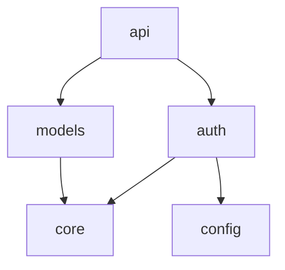

# Feature Landscape: ANRSM v0.1.1 — Multi-Language & Knowledge Layer

**Domain:** Code Analysis & Documentation — Agent-Oriented Semantic Mirror
**Milestone:** v0.1.1 — Python Adapter, Go Adapter, Module Mirror, Knowledge Layer
**Researched:** 2026-03-21
**Confidence:** MEDIUM-HIGH

---

## Scope

本文件仅覆盖 v0.1.1 新增功能的特性分析。已有功能（TS/JS 适配器、文件级镜像、指纹、漂移检测、门禁、路由索引、MCP Server）不在此次分析范围内。

**新增能力：**
1. Python 语言适配器
2. Go 语言适配器
3. 模块级镜像聚合
4. 知识层文档生成

---

## 1. Python Language Adapter

### Expected Behavior

Python 适配器应通过 tree-sitter-python 解析 Python 源码，提取与 TS 适配器对齐的结构化事实，映射到现有 `FileResult` 类型系统。

**tree-sitter-python 节点类型关键映射：**

| Python 概念 | tree-sitter 节点 | ANRSM 映射 |
|-------------|-----------------|------------|
| `def func()` | `function_definition` → `name: (identifier)` | `ExportedSymbol(kind=Function)` |
| `class Foo` | `class_definition` → `name: (identifier)` | `ExportedSymbol(kind=Class)` |
| `VAR = val` | `assignment` → left side `identifier` | `ExportedSymbol(kind=Const)` |
| `import os` | `import_statement` → module `dotted_name` | `DependencyEdge(kind=Named, source="os")` |
| `from os import path` | `import_from_statement` → module + `import` names | `DependencyEdge(kind=Named, source="os", symbols=["path"])` |
| `@decorator` | `decorator` child of function/class | `SideEffect` 或 `ExportedSymbol` 的修饰信息 |
| `with open(...)` | `with_statement` → `call` containing `open` | `SideEffect(kind=Io)` |
| `requests.get(...)` | `call` with `attribute` access | `SideEffect(kind=Network)` |
| Type hints `: str` | `type` child of `parameters` | `Parameter.type_annotation` |
| Return type `-> str` | `type` child after `->` | `FunctionSignature.return_type` |

### Table Stakes Features

| Feature | Why Expected | Complexity | Notes |
|---------|--------------|------------|-------|
| **函数定义提取** | Python 最基本的代码单元 | Medium | `def name(params) -> return_type:` |
| **类定义提取** | Python OOP 核心 | Medium | `class Name(Base):` — 需要提取基类信息 |
| **import 语句提取** | 依赖图基础 | Medium | 支持 `import X`, `from X import Y`, `from .X import Y`（相对导入） |
| **装饰器检测** | Python 特有模式 | Low | `@decorator` 作为函数/类的元信息 |
| **类型注解提取** | 现代 Python 标准 | Medium | `def f(x: int) -> str:` — 需要解析 `type` 节点 |
| **语法错误容忍** | 与 TS 适配器一致的 confidence 机制 | Low | tree-sitter 错误恢复 → ConfidenceBand::Low |
| **__init__.py 处理** | Python 包标识 | Low | 特殊处理：可能为空，可能有 `__all__` |

### Differentiators

| Feature | Value Proposition | Complexity | Notes |
|---------|-------------------|------------|-------|
| **`__all__` 解析** | Python 惯用的显式导出声明，等效于 TS 的 `export` | Medium | 如果有 `__all__`，只提取列表中的符号作为导出 |
| **相对导入解析** | Python 包内引用的常见模式 | Medium | `from . import X`, `from ..utils import Y` |
| **`@property` / `@staticmethod` / `@classmethod`** | 识别方法类型，而非全部标记为 Function | Low | 装饰器 → 方法类型元数据 |
| **dataclass / Pydantic 检测** | 识别数据模型模式 | Low | `@dataclass`, `BaseModel` 子类 → 特殊的 ExportKind |

### Anti-Features

| Anti-Feature | Why Avoid | What to Do Instead |
|--------------|-----------|-------------------|
| **运行 Python 代码** | 安全风险，且违背"纯解析"原则 | 只做 AST 提取，不执行代码 |
| **动态导入分析** | `importlib.import_module(x)` 中 x 是变量，无法静态确定 | 标记为 SideEffect(kind=DynamicImport) 而非尝试解析 |
| **类型推断** | 需要完整的类型检查器（mypy/pyright 领域） | 只提取显式注解，不推断 |

### ExportKind 扩展需求

现有 `ExportKind` 枚举需要扩展以覆盖 Python 概念：

| 现有值 | Python 等效 | 是否需要新值 |
|--------|------------|-------------|
| `Function` | `def` | ✅ 复用 |
| `Class` | `class` | ✅ 复用 |
| `Const` | `UPPER_CASE` 变量 | ✅ 复用 |
| `Var` | 普通变量 | ✅ 复用（Python 中较少用作导出） |
| — | `decorated` 函数/类 | ⚠️ 考虑不新增，装饰器作为元数据 |
| — | `TypeAlias` (`type Foo = ...` in 3.12+) | ⚠️ Python 3.12 `type` 语句可映射到 `Type` |

### SideEffectKind 扩展需求

| 现有值 | Python 等效 | 需求 |
|--------|------------|------|
| `Io` | `open()`, `pathlib.Path` 操作 | ✅ 复用 |
| `Network` | `requests.*`, `urllib`, `httpx.*` | ✅ 复用 |
| `Log` | `logging.*`, `print()` | ✅ 复用 |
| `Storage` | `shelve`, `pickle`, `sqlite3` | ✅ 复用 |
| — | `subprocess.*` | ⚠️ 可能需要新 Kind: `Process` |
| — | `os.environ`, `sys.*` | ⚠️ 可标记为 `Io` 或新增 `Env` |

**决策：** v0.1.1 不扩展枚举，用现有值做近似映射。`subprocess` → `Io`，`os.environ` → `Storage`。后续再评估是否需要精确扩展。

### Dependencies on Existing

- **硬依赖：** `LanguageAdapter` trait (`wtcd-core/src/adapter.rs`) — 已实现，无需修改
- **软依赖：** `FileResult` 类型 (`wtcd-core/src/types.rs`) — 可能需要扩展 `ExportKind` 和 `SideEffectKind`（见上）
- **无依赖：** 镜像生成、指纹、漂移检测 — 完全复用

---

## 2. Go Language Adapter

### Expected Behavior

Go 适配器通过 tree-sitter-go 解析 Go 源码。Go 的独特性在于：**大小写即可见性**（大写导出、小写包内私有），无 `export` 关键字。

**tree-sitter-go 节点类型关键映射：**

| Go 概念 | tree-sitter 节点 | ANRSM 映射 |
|---------|-----------------|------------|
| `func Name()` | `function_declaration` → `name: (identifier)` | `ExportedSymbol(kind=Function)` — 首字母大写则导出 |
| `func (T) Method()` | `method_declaration` → `name` + `receiver` | `ExportedSymbol(kind=Function)` — 方法作为 T 的关联函数 |
| `type Foo struct` | `type_declaration` → `type_spec` → `name` | `ExportedSymbol(kind=Class)` — struct 映射到 Class |
| `type I interface` | `type_declaration` → `type_spec` → `interface_type` | `ExportedSymbol(kind=Interface)` |
| `const X = ...` | `const_declaration` → `const_spec` → `name` | `ExportedSymbol(kind=Const)` |
| `var X = ...` | `var_declaration` → `var_spec` → `name` | `ExportedSymbol(kind=Var)` |
| `import "pkg"` | `import_declaration` → `import_spec` → `path` | `DependencyEdge` |
| `func init()` | `function_declaration` with name `init` | `SideEffect` — init 函数是自动执行的 |
| `go func()` | `go_statement` → goroutine | `SideEffect(kind=Concurrency)` |

### Table Stakes Features

| Feature | Why Expected | Complexity | Notes |
|---------|--------------|------------|-------|
| **函数/方法声明提取** | Go 最基本的代码单元 | Medium | `func Name(params) returns` + method receiver `func (T) M()` |
| **struct/interface/type 提取** | Go 类型系统核心 | Medium | `type Name struct { ... }`, `type Name interface { ... }` |
| **import 语句提取** | 依赖图基础 | Low | `import "fmt"`, `import alias "path"` |
| **常量/变量提取** | 包级导出 | Low | `const`, `var` 块声明 |
| **可见性判断** | Go 独有：首字母大小写 = 导出/私有 | Medium | 首字母大写 → 导出；首字母小写 → 仅包内可见 |
| **语法错误容忍** | 与 TS/Python 适配器一致 | Low | tree-sitter 错误恢复 |

### Differentiators

| Feature | Value Proposition | Complexity | Notes |
|---------|-------------------|------------|-------|
| **Method Receiver 提取** | `func (s *Server) Handle()` — 识别方法属于哪个类型 | Medium | 作为签名的一部分 |
| **struct 字段提取** | `Name string \`json:"name"\`` — 结构化类型契约 | Medium | 从 `field_declaration_list` 提取字段名+类型 |
| **interface 方法列表提取** | `interface { Read([]byte) (int, error) }` | Medium | 作为 Interface 类型的契约 |
| **嵌入式结构体识别** | `type T struct { Base }` — Go 的"继承" | Low | 作为 struct 的 special field |
| **goroutine/channel 检测** | 识别并发模式 | Medium | `go f()`, `ch <- x`, `<-ch` → SideEffect |
| **`//go:embed` 等指令检测** | 编译器指令 = 特殊副作用 | Low | `//go:generate`, `//go:embed` |

### Anti-Features

| Anti-Feature | Why Avoid | What to Do Instead |
|--------------|-----------|-------------------|
| **CGo 分析** | 涉及 C 代码解析，复杂度过高 | 标记为 `import "C"` → 特殊依赖边 |
| **泛型约束深度分析** | Go 1.18+ 泛型，约束表达复杂 | 提取类型参数名，不深度分析约束表达式 |
| **vendor / go.mod 解析** | 模块系统管理工具的领域 | 只做 AST 级 import 路径提取，不做版本解析 |

### ExportKind 扩展需求

| 现有值 | Go 等效 | 决策 |
|--------|---------|------|
| `Function` | `func` (包括方法) | ✅ 复用 |
| `Class` | `struct` | ✅ 复用 — 虽然 Go 没有 class，但 struct 是最接近的概念 |
| `Interface` | `interface` | ✅ 已有 |
| `Const` | `const` | ✅ 复用 |
| `Var` | `var` | ✅ 复用 |
| `Type` | `type Foo = Bar` (type alias) | ✅ 复用 |
| — | `func (T) Method()` | ⚠️ 不新增 Kind，方法仍为 Function，receiver 信息放入签名 |

### Dependencies on Existing

- **硬依赖：** `LanguageAdapter` trait — 无需修改
- **软依赖：** `FileResult` 类型 — 基本不需要扩展，Go 的概念可以映射到现有枚举
- **无依赖：** 镜像、指纹、漂移 — 完全复用

---

## 3. Module-Level Mirror Aggregation

### Expected Behavior

模块级镜像是**文件级镜像之上**的聚合层。它将一个模块（目录/包）内的所有文件镜像合并为一份高层语义摘要，为 Agent 提供"先看模块，再看文件"的读取路径。

**核心概念：**
- **Module**: 由 Scope Config 或目录结构定义的一组相关文件
- **Module Mirror**: 聚合多个 File Mirror 的输出，生成模块级职责、契约、依赖
- **层级关系**: Module Mirror 包含 File Mirror 列表的引用，但不复制其内容

### Table Stakes Features

| Feature | Why Expected | Complexity | Notes |
|---------|--------------|------------|-------|
| **模块级导出汇总** | 模块对外暴露什么？汇总所有文件的导出 | Medium | `merge(exports from all files)` |
| **模块级依赖汇总** | 模块依赖哪些外部模块？ | Low | `distinct(import sources from all files)` |
| **模块级职责描述** | 模块是干什么的？从文件名/导出推断 | Medium | 模板生成，类似文件镜像的 responsibilities |
| **文件列表索引** | 模块内包含哪些文件 | Low | 直接来自 Scope Manager |
| **模块级副作用汇总** | 模块级 side effects 聚合 | Low | `distinct(side effects from all files)` |

### Differentiators

| Feature | Value Proposition | Complexity | Notes |
|---------|-------------------|------------|-------|
| **模块内依赖图** | 文件 A 依赖文件 B？模块内部拓扑 | High | 从 import 解析内部引用，构建有向图 |
| **模块边界检测** | 自动发现模块（目录 vs 配置 vs 命名约定） | Medium | Python: 包含 `__init__.py` 的目录；Go: 同 `package` 声明 |
| **模块级指纹** | 模块整体变化的语义指纹 | Medium | 聚合文件指纹（hash of sorted child fingerprints） |
| **模块级漂移检测** | 模块级 C0-C3 分类 | High | 文件级漂移的上卷（rollup）规则 |
| **扇入/扇出统计** | 一个模块被多少模块依赖？ | Medium | 用于 C3 系统性分类的模块级版本 |

### Anti-Features

| Anti-Feature | Why Avoid | What to Do Instead |
|--------------|-----------|-------------------|
| **自动模块命名** | 无法可靠推断语义名称 | 从配置 `module_id` 或目录名，不尝试 LLM 命名 |
| **模块级知识文档（自由格式）** | 模块镜像应保持结构化 | 知识层在模块镜像之上单独生成 |
| **跨模块依赖图** | v1 聚焦单仓内的模块关系 | 模块内依赖图优先，跨模块标记为边界边 |

### Architecture Design

**模块发现策略（按语言）：**

| 语言 | 模块定义 | 发现方式 |
|------|---------|---------|
| TypeScript/JS | 目录 + `index.ts` 入口 | Scope 中 `source_roots` 下的目录 |
| Python | 包 = 含 `__init__.py` 的目录 | 目录扫描，`__init__.py` 存在即为模块 |
| Go | `package` 声明 | AST 中 `package_clause` 节点，同 package 名 = 同模块 |

**输出格式（Module Mirror）：**

```markdown
---
anrsm_version: 1
artifact_type: module_mirror
artifact_id: module_mirror:src/auth
source_paths:
  - src/auth/login.ts
  - src/auth/session.ts
  - src/auth/middleware.ts
module_id: auth
source_commit: abc1234
module_fingerprint: sha256:...
freshness_state: fresh
confidence_band: high
---

## 职责
身份认证与会话管理模块。暴露 login、logout、verifyToken 等核心函数。

## 模块导出
- login (Function) — src/auth/login.ts
- logout (Function) — src/auth/login.ts
- verifyToken (Function) — src/auth/middleware.ts
- Session (Type) — src/auth/session.ts

## 外部依赖
- src/core/http/client.ts
- node:crypto
- src/config/index.ts

## 模块内拓扑
login.ts → session.ts（使用 createSession）
middleware.ts → session.ts（使用 getSession）
login.ts ← middleware.ts（无反向依赖）

## 副作用
- Network: auth service calls (login.ts:15)
- Io: session file storage (session.ts:22)

## 关键不变量与风险
- 外部认证服务调用需关注错误处理和幂等性
- Session 存储涉及文件 I/O，需关注并发安全

## 何时必须展开源码
- 修改认证流程或 Token 签发逻辑时
- 修改 Session 存储或过期策略时
- 涉及错误处理、并发控制或状态管理时
```

### Dependencies on Existing

- **硬依赖：** 文件级镜像生成（已实现）— 模块镜像是文件镜像的聚合
- **硬依赖：** Scope Manager — 需要知道哪些文件属于哪个模块
- **软依赖：** `Config` 类型 — 可能需要 `modules:` 配置块定义模块边界
- **软依赖：** 依赖图 — 模块内拓扑需要内部依赖解析
- **新需求：** `MirrorHeader.artifact_type` 已有 `file_mirror`，需新增 `module_mirror`
- **新需求：** `MirrorBody` 可能需要为模块镜像定义不同的 section 结构（或复用 8 section 但语义不同）

---

## 4. Knowledge Layer Document Generation

### Expected Behavior

知识层是三层层级架构的最顶层：**文件镜像 → 模块镜像 → 知识层**。它将结构化的镜像数据编译为面向人类和 Agent 的高层文档，回答"这个仓库是什么？怎么组织的？核心概念有哪些？"

**核心原则（来自规范 A4）：**
- 知识层必须从镜像或结构化事实派生（不做自由文本 Wiki）
- 两段式流水线：结构化提取 → 语义压缩
- 不可替代源码（Knowledge as Code，不是 Knowledge replaces Code）

### Table Stakes Features

| Feature | Why Expected | Complexity | Notes |
|---------|--------------|------------|-------|
| **仓库总览文档** | "这个仓库是什么？" — 最基本的知识层产出 | Medium | 从模块镜像聚合：模块列表、语言分布、入口文件 |
| **模块关系图（文本化）** | 模块间依赖关系 | Medium | 从 import/require 边推导，Mermaid 或 ASCII 格式 |
| **导出索引** | 所有对外暴露符号的全局索引 | Low | 从文件/模块镜像的 exports 字段汇总 |
| **语言/文件统计** | 仓库规模和组成 | Low | 直接从 RunSummary 或 Scope 聚合 |

### Differentiators

| Feature | Value Proposition | Complexity | Notes |
|---------|-------------------|------------|-------|
| **语义聚类** | 自动发现"功能域"（如 auth、payments、infra） | High | 基于依赖密度的社区发现算法（graph clustering） |
| **变更热点图** | 哪些模块变更最频繁？与漂移检测结合 | Medium | git log 分析 + 镜像新鲜度 |
| **Token 压缩报告** | 镜像 vs 源码的 token 比例 | Low | `mirror_tokens / source_tokens` — ANRSM 独有指标 |
| **Agent 读取路径建议** | "处理 auth 问题时，先读 X → Y → Z" | Medium | 基于依赖图 + 路由索引的 BFS 路径 |
| **ADR 自动骨架** | 从漂移报告生成 Architecture Decision Record 骨架 | Low | 模板 + C2/C3 变更数据 |

### Anti-Features

| Anti-Feature | Why Avoid | What to Do Instead |
|--------------|-----------|-------------------|
| **LLM 生成自由文本** | 违反 A4 公理，不可验证，可能幻觉 | 纯模板 + 结构化数据，不调用 LLM |
| **Wiki 式编辑** | 双真相源风险（R1） | 知识层只从镜像编译，不接受人工编辑 |
| **完整 UML 图生成** | 过于复杂，维护成本高 | 文本化依赖图（Mermaid）足够，不做完整 UML |
| **替代 README** | README 是人类维护的，知识层是编译的 | 知识层输出为独立文件，不覆盖 README |

### Output Format

**仓库总览 (`knowledge/README.md`)：**

```markdown
---
anrsm_version: 1
artifact_type: knowledge_layer
artifact_id: knowledge:root
source_commit: abc1234
generated_at: 2026-03-21T10:00:00Z
generator_name: anrsm
generator_version: 0.1.1
---

# 仓库概览

## 语言分布
- TypeScript: 42 files (65%)
- Python: 18 files (28%)
- Go: 5 files (7%)

## 模块拓扑


## 核心导出
| 模块 | 符号 | 类型 | 文件 |
|------|------|------|------|
| auth | login | Function | src/auth/login.ts |
| auth | Session | Type | src/auth/session.ts |
| api | createRouter | Function | src/api/router.ts |

## Token 经济性
- 源码总 token: ~125,000
- 镜像总 token: ~8,500
- 压缩比: 14.7:1

## 读取路径建议
- 处理认证问题: auth/login.ts → auth/session.ts → auth/middleware.ts
- 添加新 API 端点: api/router.ts → api/handlers/ → models/
```

### Architecture Design

**知识层生成流水线：**

```
File Mirrors (N个)
    ↓ 聚合
Module Mirrors (M个)
    ↓ 编译
Knowledge Layer Documents
    ├── knowledge/README.md (仓库总览)
    ├── knowledge/modules.md (模块索引)
    ├── knowledge/exports.md (全局导出索引)
    └── knowledge/graph.md (依赖图)
```

**配置（anrsm.yaml 新增）：**

```yaml
knowledge:
  enabled: true
  output_dir: knowledge
  include:
    - overview
    - module_index
    - export_index
    - dependency_graph
  format: markdown  # 或 future: html
```

### Dependencies on Existing

- **硬依赖：** 模块级镜像（本 milestone 新增）— 知识层从模块镜像聚合
- **硬依赖：** 文件级镜像 — 知识层依赖文件镜像的 exports/imports/side_effects
- **软依赖：** 路由索引 — Agent 读取路径建议需要路由数据
- **软依赖：** 漂移检测 — 变更热点图需要漂移历史
- **新需求：** `knowledge:` 配置块（anrsm.yaml 扩展）
- **新需求：** `knowledge/` 输出目录
- **新需求：** 新的 `artifact_type: knowledge_layer`

---

## Feature Dependencies（特性依赖关系）

```
                    ┌──────────────┐
                    │ LanguageAdapter │ (已有)
                    │   trait       │
                    └──────┬───────┘
                           │
           ┌───────────────┼───────────────┐
           │               │               │
    ┌──────▼──────┐ ┌──────▼──────┐ ┌──────▼──────┐
    │ TS Adapter  │ │ Python      │ │ Go          │
    │ (已有)      │ │ Adapter     │ │ Adapter     │
    └──────┬──────┘ └──────┬──────┘ └──────┬──────┘
           │               │               │
           └───────────────┼───────────────┘
                           │
                    ┌──────▼───────┐
                    │ FileResult   │ (已有，可能扩展)
                    │ per-file     │
                    └──────┬───────┘
                           │
                    ┌──────▼───────┐
                    │ File Mirror  │ (已有)
                    │ Generation   │
                    └──────┬───────┘
                           │
                    ┌──────▼───────┐
                    │ Module-Level │ (新增)
                    │ Aggregation  │
                    └──────┬───────┘
                           │
                    ┌──────▼───────┐
                    │ Knowledge    │ (新增)
                    │ Layer        │
                    └──────────────┘
```

**关键路径：**
1. Python/Go 适配器独立于模块/知识层，可并行开发
2. 模块镜像聚合依赖文件镜像存在（已有）
3. 知识层依赖模块镜像聚合完成
4. Python/Go 适配器 → 文件镜像 → 模块镜像 → 知识层

---

## Implementation Complexity Summary

| Feature | Complexity | Effort Estimate | Risk |
|---------|-----------|-----------------|------|
| Python Adapter | Medium | 3-5 days | LOW — tree-sitter-python 成熟，TS 适配器可作模板 |
| Go Adapter | Medium | 3-5 days | LOW — tree-sitter-go 成熟，Go AST 结构清晰 |
| Module Aggregation | High | 5-8 days | MEDIUM — 模块发现/边界定义需要设计决策 |
| Knowledge Layer | Medium | 3-5 days | LOW — 模板 + 聚合，无 LLM 依赖 |

---

## Confidence Assessment

| Area | Confidence | Notes |
|------|------------|-------|
| Python Adapter features | HIGH | tree-sitter-python 0.25.0 可用，Python AST 结构成熟，社区大量参考 |
| Go Adapter features | HIGH | tree-sitter-go 0.25.0 可用，Go 语言规范清晰，大小写可见性机制简单 |
| Module Aggregation | MEDIUM | 模块边界定义（Python 包 vs Go package vs TS 目录）有歧义，需要设计决策 |
| Knowledge Layer | MEDIUM | 输出格式和内容深度有多种选择，需要与用户需求对齐 |

---

## Open Questions

1. **模块边界配置 vs 自动发现？**
   - Python: `__init__.py` 目录是自然边界
   - Go: `package` 声明是自然边界
   - TS/JS: 目录？`package.json`？配置？
   - **建议：** 自动发现 + `anrsm.yaml` 中可选的 `modules:` 覆盖

2. **模块镜像的指纹如何计算？**
   - 选项 A: 聚合文件指纹（`hash(sorted(child_fingerprints))`）
   - 选项 B: 对模块级语义事实重新计算
   - **建议：** 选项 A — 确定性好，与文件级指纹一致

3. **知识层是否需要指纹/漂移检测？**
   - 知识层是派生品，源码变化 → 文件镜像变化 → 知识层自然"变化"
   - **建议：** v0.1.1 不对知识层做独立指纹，因为它完全由下层派生

4. **Python `__all__` 的语义？**
   - 有 `__all__` 时：只有列表中的符号被视为导出
   - 无 `__all__` 时：所有顶层 `def`/`class`/常量被视为导出
   - **建议：** 优先检查 `__all__`，无则全量导出（与 TS 适配器行为一致）

5. **tree-sitter 版本对齐？**
   - tree-sitter 核心: 0.26.7
   - tree-sitter-python: 0.25.0（dev dependency 引用 tree-sitter ^0.25.8）
   - tree-sitter-go: 0.25.0（同上）
   - **风险：** tree-sitter-language crate ^0.1 作为中间层统一版本，但需要验证兼容性

---

## Sources

- tree-sitter-python crate: crates.io 0.25.0, 5.17M downloads, 306 reverse deps
- tree-sitter-go crate: crates.io 0.25.0, 3.77M downloads, 199 reverse deps
- tree-sitter core: crates.io 0.26.7, MSRV 1.77
- Existing TS adapter: `crates/wtcd-adapters/src/ts.rs` — 模板参考
- Existing trait: `crates/wtcd-core/src/adapter.rs` — `LanguageAdapter` trait 定义
- Existing types: `crates/wtcd-core/src/types.rs` — `FileResult`, `ExportKind`, 等
- Existing mirror: `crates/wtcd-mirror/src/template.rs` — 8-section body 模板
- Existing fingerprint: `crates/wtcd-mirror/src/fingerprint.rs` — 语义指纹算法
- Existing config: `crates/wtcd-core/src/config.rs` — `anrsm.yaml` 结构
- AutomaDocs architecture: dev.to 2026-03-03 — tree-sitter + Claude 的文档生成模式
- Context+ MCP: scriptbyai.com 2026-03-03 — Feature Hubs, spectral clustering
- Knowledge as Code: dev.to 2026-03-18 — 自验证知识库模式
- LogicLens: arxiv 2026-01-15 — 跨仓库语义图构建
- AST Explorer patterns: dev.to 2025-05-06 — tree-sitter Python 节点类型参考

---

*Researched: 2026-03-21*
*Ready for roadmap: yes*
